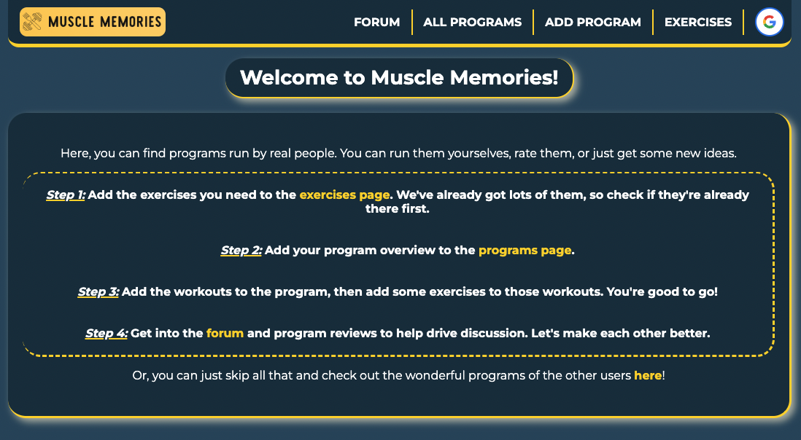

## Muscle Memories

---
### 💪 [Go to Muscle Memories!](https://muscle-memories.fly.dev/)

Are you as tired of instagram-style workouts as I am? There's no prograssion, the exercises are flashy and ineffective, and most importantly it's not what real people do in the gym! I wanted to make a place where people could come and discuss the programs they actually run. It's a user-friendly and invaluable tool for anyone interested in lifting weights.

The site has a big list of exercises to choose from and users can add more to the website. You construct your workout by selecting some basic details like name and muscle group split. Then you add your workouts to the program and exercises to the workouts. Others can let you know what they think by running your program and leaving a review!

Got some questions about fitness, or just want to talk with some like-minded people? Head into the forum and create a topic about whatever you want. I'd love to hear from you!

#### ✨ Features:

- Full CRUD across multiple models using with MongoDB. Users can add, delete, edit and read their programs, workouts within those programs, and exercises within those workouts.
- Forum where users can post threads pertaining to whatever topic they like, fitness or otherwise. Then users can head into those threads and discuss.
- Full implementation of Google OAuth so the user is the only one who can edit and delete your own programs and content.
- Review programs that you have run from other users.
- Implements RESTful routing practices.

---
### 🧑‍💻 Technical Requirements:

- HTML
- CSS
- EJS
- JavaScript
- Git
- MongoDB
- Mongoose
- Node.js
- Passport.js
- Google OAuth

---
### 📝 Planning Materials:

1. Wireframe and ERD created with [Whimsical](https://whimsical.com/).
2. Thanks to [Trello](https://trello.com/) for providing a great platform for my [project planning materials](https://trello.com/b/jB5qCNTv/muscle-memories). Please feel free to check out my Trello board!

### 🙏 Attributions: 

1. Logo created with [LOOKA](https://looka.com/?gclid=CjwKCAjwyNSoBhA9EiwA5aYlb6gB8KJ_SKpa7WYEApTxktZAiRlnNSsKsI2XZ65qw3KS-NURSo0YKBoCwm4QAvD_BwE).
2. Big shout out and thank you to [Tuan Nyugen](https://github.com/TuanNguyen0915) for showing his method for dynamically rendering edit forms for comments, post names and reviews. Be sure to check out his great work in the GitHub link!
3. [Google Fonts](https://fonts.google.com/) for montserrat.

### 🧊 Icebox: 

Since this project is such a passion project, there's a lot more that I'd like to do with it. Heres some planned updates for the futture:

- Add ability to delete exercises only if you are the creator and the exercise is not currently in any Program.
- Add search functionality for programs, exercises and forum posts.
- Refactor to include muscle groups as a static asset so they may be seleected from a dropdown.
- Create user-friendly easy PDF printouts of the programs so people can run them.
- Create a workout logger where you log the workouts that you've done for easily trackable progress.
- Create a blog portion for sharing my thoughts and ideas on programming and exercise selection.